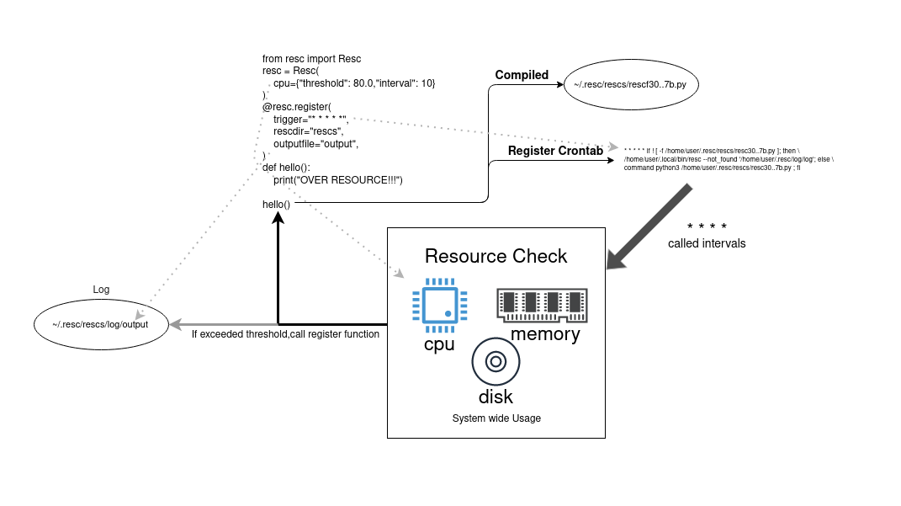
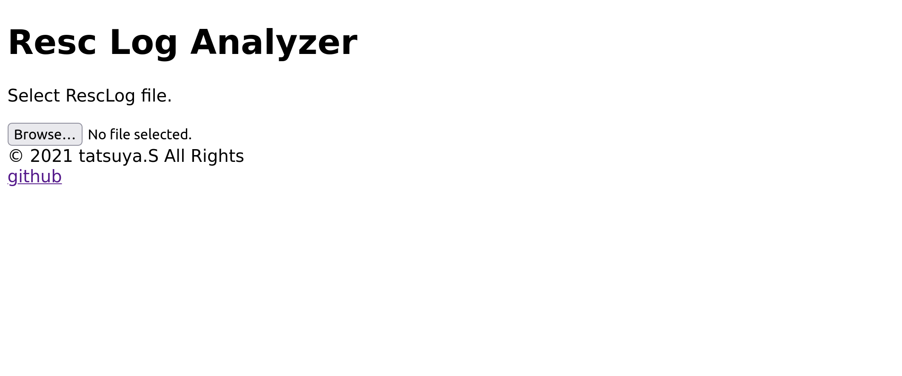
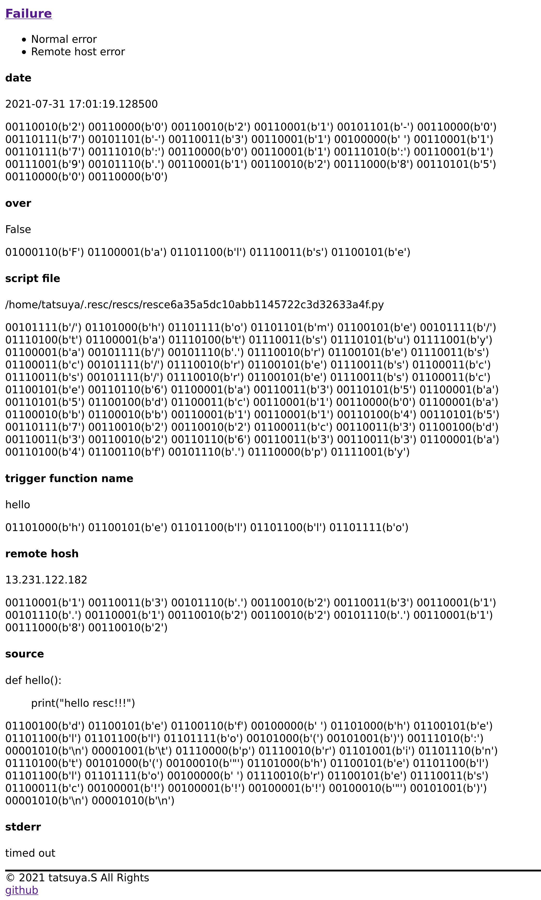

[](https://github.com/tatsuya4649/resc/actions/workflows/build.yml)


[](https://lgtm.com/projects/g/tatsuya4649/resc/context:javascript)
[](https://lgtm.com/projects/g/tatsuya4649/resc/context:python)
[](https://codecov.io/gh/tatsuya4649/resc)

# Resource checker

Resc check resources(CPU,memory,disk) of target host(local or remote) and execute script.

# Install

```
pip install resc

```

# Usage

example Python code.

```kkkkkkkkkkkkkkk
from resc import Resc

resc = Resc(
	cpu={"threshold": 80.0,"interval": 10},
	memory={"threshold": 90.0},
	disk={"threshold":75,"path":"/"},
)

@resc.register(
	trigger="* * * * *",	# crontab job time
	rescdir="rescs",	# output directory of compiled python script file
	outputfile="output",	# output file of crontab if it is fired when resource threshold is exceeded.(directory: ~/.resc/log/ + outputfile)
	ip="13.231.122.182",	# if check remote host,specify IP address
	username="ubuntu",	# if check remote host,remote host username
	call_first=True,			# call just now?
	key_path="~/.aws/ExampleSSH.pem", # if check remote host, key file path to connect remote host with SSH.
)
def hello():
	print("OVER RESOURCE!!!")

hello()
```

# How does that work?



1. Register decorator is a decorator to prepare for resource check using given threshold of resources,host information,etc.
2. Decorated function(above def hello()) is called function when resource threshold is exceeded.
3. Make new python script for crontab.(~/.resc/ + rescdir)
4. Register crontab with 3.python script and interval info(trigger argument of register decorator).

If call_first argument is False(default False), decorated function is not called until resource threshold are exceeded.

WARNING: Because decorated function will be compiled, it must be coded as an independent scope.

## bad example.

```
import math
class Bad:
	@classmethod
	def example(self):
		return "hello world"

def bad():
	# NameError: name 'math' is not defined
	math.floor(10.9)
	Bad.example()
```

## good example.

```
def good():
	import math
	class Bad:
		@classmethod
		def example(self):
			return "hello world"
	math.floor(10.9)
```

# Command Line

```

CPU or Memory or Disk must be not empty.
usage: resc [-h] [-c CPU_T] [--cpu_mode CPU_MODE] [-i CPU_INTERVAL] [-m MEM_T] [--mem_mode MEM_MODE] [-d DISK_T] [-p DISK_PATH]
            [--disk_mode DISK_MODE] [--log LOG] [-s] [-q] [--not_found NOT_FOUND]

Resouce Checker.

optional arguments:
  -h, --help            show this help message and exit
  -c CPU_T, --cpu_t CPU_T
                        CPU threshold value
  --cpu_mode CPU_MODE   CPU mode
  -i CPU_INTERVAL, --cpu_interval CPU_INTERVAL
                        Time to confirm CPU threshold
  -m MEM_T, --mem_t MEM_T
                        Memory threshold value
  --mem_mode MEM_MODE   Memory mode
  -d DISK_T, --disk_t DISK_T
                        Disk threshold value
  -p DISK_PATH, --disk_path DISK_PATH
                        Disk path
  --disk_mode DISK_MODE
                        Disk mode
  --log LOG             Analize log file.receive path.
  -s, --log_server      Analize log file on GUI.
  -q                    Quiet output
  --not_found NOT_FOUND
                        for crontab. If not found script, write to log

```

# Term

**threshold**(cpu):  threshold that is system-wide CPU utilization as a percentage.int or float type.

**interval**(cpu): interval is check interval time(s).int or float type.

**threshold**(memory): threshold that is system memory utilization as a percentage.int or float type.

**path**(disk): check the capacity of the partition according to the given path.

**threshold**(disk): threshold that is partition utilization which containes given path.


# Log Analyze Server

You can use the server to analyze the RescLog file.

**in python code**

```
from resc import start_server

# log server must be in main module.
if __name__ == "__main__":
    start_server()
```

**command line**

```
resc --log-serkver
```

Defualt bind host is 127.0.0.1, bind port is 55555.

If you want to change them, set environment variebales. host is RESCLOGSERVER_IP, port is RESCLOGSERVER_PORT.

**command line(custom port version)**

```
RESCLOGSERVER_PORT=44444 resc --log-serkver
```

Then, start log server to analyze your Resc log file.

```
INFO:     Uvicorn running on http://127.0.0.1:55555 (Press CTRL+C to quit)
INFO:     Started reloader process [262092] using statreload
INFO:     Started server process [262094]
INFO:     Waiting for application startup.
INFO:     Application startup complete.
```



If you accessed this url with web browser, display like this image.

Select log file, display result of analyzing.



* Failure/Success: Whether a error has occured or not.
* date: Logggine date. the date when the registered function was called.
* over: Whether the threshold of the registered resource has been exceeded or not.
* script file: Called python script(compiled script).
* trigger function name: Registered function name.
* remote host: Remote host that registered resources are checked.
* source: 'trigger' function code.
* stdout: Stdout of trigger function.
* stderr: Stderr of trigger function.

# Crontab

Crontab is a important element of this library.So, show 'man crontab or crontab -e' for detail of crontab

# Required

Python3(>=3.6),Crontab,and python library in requirements.txt.

# LICENCE

This project is licensed under the terms of the MIT license.

